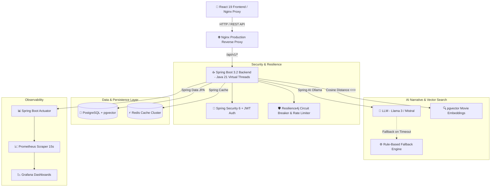

# 🎬 CinePick — AI-Powered Production-Grade Film Discovery Engine

<div align="center">


</div>

---

## 📌 Architectural Overview

CinePick is an enterprise-grade, high-performance hybrid film discovery and AI narrative analysis engine powered by **Spring Boot 3/4 (Java 21)**, **Spring AI (Ollama)**, **pgvector**, **Redis Caching**, and **React 19**.



---

## ✨ Key Features & Technical Highlights

### 🛡️ 1. Enterprise Persistence & JWT Security
- **PostgreSQL Database**: Dynamic schema updates via JPA with strict index optimizations.
- **Stateless JWT Security**: Spring Security 6 integration with custom `OncePerRequestFilter`, `BCryptPasswordEncoder`, and role-based permissions.
- **Relational Domain Models**: `User`, `Movie`, and `UserMovieInteraction` entities with support for `WATCHLIST`, `WATCHED`, and user ratings.

### 🧠 2. Spring AI & pgvector Hybrid Narrative Engine
- **LLM Structured Output**: Leverages Spring AI `BeanOutputConverter<MovieAnalysisResponse>` for zero-shot structured JSON extraction.
- **pgvector Cosine Search**: Generates 1536-dimensional vector embeddings for movie overviews, performing top-K similarity searches via `ORDER BY embedding <=> ?::vector`.
- **Fail-Safe Fallback**: Automatic execution of legacy rule-based analyzer whenever LLM inference times out or fails.

### ⚡ 3. High-Performance Infrastructure & Resilience
- **Multi-TTL Redis Caching**: 24-hour TTL for LLM narrative analyses and 12-hour TTL for TMDB movie payloads using Jackson2 JSON serialization.
- **Resilience4j Fault Tolerance**: Circuit breaker pattern and rate limiters protecting external TMDB endpoints from cascading failures.
- **Java 21 Virtual Threads**: Non-blocking concurrency enabled via `spring.threads.virtual.enabled=true`.

### 🐳 4. Production Containerization & SRE Observability
- **Multi-Stage Dockerfiles**: Secure, minimal runtime footprints leveraging Maven builder stages and `Eclipse Temurin JRE Alpine` runtime containers.
- **Docker Compose Orchestration**: Single-command startup with `depends_on: condition: service_healthy` checks.
- **Observability Stack**: Spring Boot Actuator exposing `/actuator/prometheus`, paired with Prometheus metric scrapers and Grafana performance dashboards.

---

## 🚀 Quickstart & Local Deployment

### Prerequisites
- [Docker & Docker Compose](https://www.docker.com/) (Version 24.0+)
- [Java 21 JDK](https://www.oracle.com/java/technologies/downloads/#java21) (For local non-containerized execution)
- [Maven 3.9+](https://maven.apache.org/)

### 1. Running the Complete Stack with Docker Compose

```bash
# Clone the repository
git clone https://github.com/Omerfaruk1609/Cinepick.git
cd Cinepick

# Spin up PostgreSQL (with pgvector), Redis, Spring Boot Backend & React Frontend
docker compose up -d --build
```

### 2. Running Monitoring & Observability Stack

```bash
# Spin up Prometheus and Grafana dashboards
docker compose -f monitoring/docker-compose.monitoring.yml up -d
```

- **Frontend App**: [http://localhost:80](http://localhost:80)
- **Backend REST API**: [http://localhost:8080/api/v1](http://localhost:8080/api/v1)
- **Prometheus Metrics**: [http://localhost:9090](http://localhost:9090)
- **Grafana Dashboard**: [http://localhost:3001](http://localhost:3001) *(Credentials: `admin` / `admin`)*

---

## 📡 API Reference

| Endpoint | Method | Security | Description |
| :--- | :--- | :--- | :--- |
| `/api/v1/auth/register` | `POST` | Public | Register a new user and return JWT bearer token |
| `/api/v1/auth/login` | `POST` | Public | Authenticate credentials and issue JWT token |
| `/api/v1/narrative/analyze-ai` | `POST` | Bearer JWT | Generate AI cinematic analysis with fallback protection |
| `/api/v1/narrative/similar` | `POST` | Bearer JWT | Query top-K similar movies using pgvector cosine distance |
| `/actuator/prometheus` | `GET` | Internal | Prometheus scraping endpoint for system metrics |

---

## 🧪 Testing & CI/CD Pipeline

The project includes automated JUnit 5 + Mockito tests and a GitHub Actions workflow:

```bash
# Run unit tests locally
mvn test
```

Pipeline configuration can be found in [`.github/workflows/ci-cd.yml`](file:///.github/workflows/ci-cd.yml).
